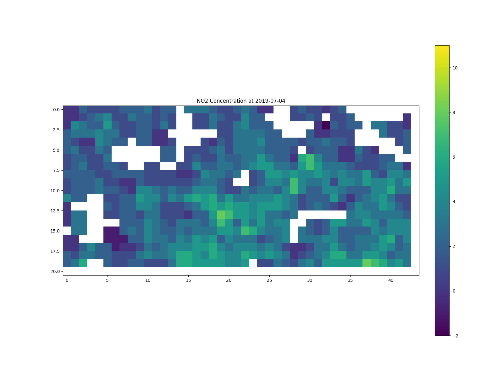

# Sentinel 5P Python Dashboard with openEO


This is an experimental Python Dashboard developed with the shiny library. The main goal of this project is to both demonstrate how can openEO and shiny be used together to build dashboards and, also demonstrate some of openEO capabilities in a more user-friendly way. In this use case, the explored data refers to NO2, coming from the TROPOMI sensor on board of Sentinel 5P (S5P) satelitte. 

The following documentation shall first of all guide the user on how to use and work with this dashboard. A guide on the different developed functionalities is presented before the code behind the dashboard is further detailed, especially demonstrating the openEO processes. Finally, some guidance is given on how the connection between the *openeo* and *shiny* packages is built. This shall help shine a path on how any python user could build their own openEO related dashboard. 

## User Guide

### How to use this application

For the time being, this application was designed to run locally. The deployment of this service will follow, although the proper EODC credentials are necessary to do so. The guidance here present demonstrates how does this *Shiny* application work and how to make it run. It was also designed to serve as a template for future *shiny* based applications using the openEO platform. In a few words, it is mainly meant to drive the creation of other UIs based on *shiny* and this was lever the use of the openEO platform. For this reason, all the steps are detailed in this README as well as possible, so one can not only reproduce this example, but use it as base for their own ideas.

After cloning this repository, one can open the main script in RStudio and press "Run App" in the upper part of the IDE or simply run the following lines in a terminal in the root folder of this repository. 

```bash
shiny run --reload --launch-browser --port=0 /home/hr/s5p-py-dashboard/app.py
```

This will start the app. If working in RStudio, it may open in a new RStudio window or a new web browser window. If this is run through the terminal, a web browser window will open with the app. It is very important to mention that the user must have already logged in in the eodc at least once. If that's not the case, the following lines of code should guide one to do it. 

```python
import openeo
con = openeo.connect("openeo.cloud")
con.authenticate_oidc()
```

Obviously enough, it is crucial to have access to openEO platform, hence to have already credentials to use it. The Services provided shall demonstrate the options that fit each user demands.  you may register for a new account or maybe a free trial. 


As one may see, there are three main tabs in the app, besides the home screen : "Time-Series Analyser", "Map Maker", and "Spacetime Animation". All examples are going to be presented, together with some explanations of the ideas behind them.

### Time Series Analyser: a temporal view 

The Time-Series Analyser allows one to see the "reduced" time series of Sentinel 5P NO2 data from a given region. The source code can be found , where you can see the whole application and the three main services it provides. Basically, to use the "Time Series Analyser" function, the user can pass the coordinates of the bounding box of the area of interest, which are shown in a dynamic map just below; but also the time frame and the cloud cover to be considered in the computation. This last one refers to the percentage (0 to 1) of values that should be really considered as cloud. It works as a quality flag. The recommendation of ESA and the Sentinel documentation is to use 0.5, the default here.


Once all parameters are set, the user may just press the "Submit button" to launch results. The default coordinates will give the user a plot of the Northern Region of Italy, in the region of Bolzano, where some  is also available for comparison. If the user's bounding box is inside this region, one will always see this data.

It is important to mention that the process can take long, especially for bigger areas. It depends a lot on a series of factors, and even the specific backend the user is using. The Terminal you're running the application shall give a hint of how the process is going. The output should look like something like this. 


### Map Maker: a spatial view

If the user desires to look at NO2 data at one given point in time, this function is the developed for this purpose. This second option in the *shiny* app allows one to visualise how does a country's pattern in NO2 looks like in a given time, following S5P NO2 data.

The parameters present are the date for the snapshot, the cloud cover quality flag, and the coordinates of the bounding box, once more.


### Spacetime Animation: a spatio-temporal view

Finally, the user can create and visualise their own spatio-temporal animation of S5P NO2 data. Given a starting and ending date, as well as the quality flag for cloud cover and a given country name, the user may have their own personalised spacetime GIF ready for their usage. The only new parameter in this view is the FPS one, that refers to the speed of change of the image frames (Frames per Second). Default is set to 2, as it usually outputs good results.

It is clever to mention that one can download the GIF for further usage by using the right mouse button over the animation in the app. 




## Behind the Scenes

### Time Series Analyser

In order to get a deeper understanding about what's going on in the background of this application, an explanation follows. Basically, two collections are first loaded, S5P data with NO2 and Cloud Cover bands. In the following, a mask is passed to the NO2 values. This means that, where a cloud is defined (considering the quality flag), no data is assigned as the pixel value in the datacube. This happens to leave the datacube with holes in it, which are filled through an interpolation process in the sequence. Once this is done, a spatial reduction and an aggregate are applied to the datacube using the mean and maximum values. Finally, the process is sent to the backend, which should deliver downloadable data in a few minutes. This is the most demanding time step.


Once that is done, that data shall come as a JSON for download, which is automatically read by the *shiny* app. A smoothing is applied to the data, so it is better looking and more comprehensible, and to also compare it to a moving average still being applied as a User Defined Function (UDF).

#### User Defined Function (UDF)

A user defined function (UDF) has also been defined for this service. This is one of the greatest advantages, if not the greatest, of using openEO, and this dashboard shall also be made use of, for also demonstrating how to implement a UDF, and more especially, now inside a *shiny* app.


The UDF defined for this *shiny* app is a Moving Average one with 30 days window size. The UDF is defined as a  with a simple implementation of a moving average. In order to call the UDF python script, one basically needs to make use of a method called *UDF* from the *openeo* python package. One shall load the UDF python script and proceed with it as follows:

```python
with open('ma.py', 'r') as file:
    udf_file = file.read()
          
udf = openeo.UDF(udf_file.format(n = moving_average_window))
datacube_ma = datacube.apply_dimension(dimension = "t", process = udf)
``` 

The UDF itself is defined as follows:

```python
from pandas import Series
import numpy as np

def apply_timeseries(series: Series, context: dict) -> Series:
    return np.convolve(series, np.ones({n})/{n}, mode='same')
```

As one can see, it is a very simple function, but it is really interesting to apply it to a datacube. From the code above, it is possible to see that the *n*, *i.e.*, the window size is not hard coded. So it is possible to change it in the app so the user can play with it. Based on the following background, one should be able to gain enough knowledge to understand how the window size of the rolling mean (*n*) could go to the app and interact with the UDF function.

### Map Maker

In order to create a plot of a snapshot of NO2 data, the process is quite similar to the time-series analyser. Although, in spite of aggregating the data and reducing the spatial dimension with the interpolated data, one simply applies a temporal filter, and the data is downloaded as GeoTiff in spite of JSON. An example of the process graph can be seen below :


### Spacetime Animation

Finally, in order to explain how does the spacetime animation works, some steps are taken similarly as in the "Map Maker", ending by the interpolation, although no other processes are applied after that. The images are simply downloaded in the time series as PNGs and the *rasterio* and *imageio* libraries are used to join them into one animated GIF file.


With the objective to create the animated the GIF, the first step is to read in the images in the input folder, state as "animation" in the app. As one can see, the date of each image is extracted from the name of the file itself. 

```python
# Read in all TIF files in folder
input_folder = "animation"
output_folder = "PNG"
filenames = os.listdir("animation")
tif_regex = re.compile(r'openEO_(\d{4}-\d{2}-\d{2})Z\.tif')
tif_files = [filename for filename in filenames if tif_regex.match(filename)]
tif_files_sorted = sorted(tif_files, key=lambda x: datetime.datetime.strptime(tif_regex.match(x).group(1), '%Y-%m-%d'))
```

The next step is then to process all images and plot them using rasterio, saving each frame as a png file. Also notice that the maximum and miminum NO2 values for all frames needs to be extracted, otherwise the frames won't be comparable in the end.

```python
# Initialize variables to hold minimum and maximum values
global_min = float('inf')
global_max = float('-inf')
          
for filename in tif_files_sorted:
    # Open TIF file
    filepath = os.path.join(input_folder, filename)
    with rasterio.open(filepath) as src:
        image = src.read(1, masked=True)
                
    # Update minimum and maximum values
    file_min = np.min(image)
    file_max = np.max(image)
    if file_min < global_min:
        global_min = file_min
    if file_max > global_max:
        global_max = file_max
          
    for filename in tif_files_sorted:
    # Open TIF file
        filepath = os.path.join(input_folder, filename)
        with rasterio.open(filepath) as src:
            image = src.read(1, masked=True)
        
        # Extract date from file name
        date_str = tif_regex.match(filename).group(1)
        input_date = datetime.datetime.strptime(date_str, '%Y-%m-%d')
        
        # Create figure and axis objects
        fig, ax = plt.subplots(figsize=(16, 12))
        
        # Plot image as a continuous variable with a color legend
        im = ax.imshow(image, cmap='viridis', vmin=global_min, vmax=global_max)
        
        # Add colorbar and title
        cbar = fig.colorbar(im, ax=ax, fraction=0.046, pad=0.04)
        ax.set_title('NO2 Concentration at ' + input_date.strftime('%Y-%m-%d'))
        
        # Save plot as PNG file
        output_filename = os.path.join("PNG", date_str + '.png')
        plt.savefig(output_filename)
            
        # delete every tif file
        os.remove(filepath)
```

After that, it is possible to generate the GIF using all the outputted png files in the "PNG" directory created in the script above. 

```python
# Create animated GIF from PNG files
images = []
for filename in os.listdir("PNG"):
    if filename.endswith('.png'):
        filepath = os.path.join("PNG", filename)
        images.append(imageio.imread(filepath))
    output_filename = os.path.join("PNG", 'spacetime-animation.gif')
    imageio.mimsave(output_filename, images, fps=input.fps())
```

## How to run openEO processes inside a python shiny APP?

If one is new to *shiny* in Python, a really good documentation can be found . This documentation is the source for all main interaction in the *shiny* app built here.

As any other *shiny* app, there will always be an UI and a Server side. Both can be coded in the same script, but they are quite differently set. The UI defines the interface of the application, and therefore one needs to define data inputs, buttons and tabs here. Below, one can see how the "Time Series Analyser" interface has been built. 

```python 
# Tab2 : Time Series Analyser
ui.nav("Time-Series Analyser", 
        
# This tab has both a sidebar and panel
ui.layout_sidebar(
        
    # Define Sidebar Inputs
    ui.panel_sidebar(
            
        # Bounding Box
        ui.input_numeric("w", "xmin (EPSG:4326)", 10.35, min = 0, step = .01),
        ui.input_numeric("s", "ymin (EPSG:4326)", 46.10, min = 0, step = .01),
        ui.input_numeric("e", "xmax (EPSG:4326)", 12.55, min = 0, step = .01),
        ui.input_numeric("n", "ymax (EPSG:4326)", 47.13, min = 0, step = .01),
            
        # Temporal Filter
        ui.input_date_range("date1date2", "Select timeframe", 
        start = "2019-01-01", end = "2019-12-31", 
        min = "2019-01-01", max = str(date.today()), startview =  "year", weekstart = "1"),

        # Map with bbox
        output_widget("map_ts"),
            
        # Cloud Cover 
        ui.input_numeric("cloud1", 
        "cloud cover to be considered? (0 to 1 - 0.5 is recommended)", 0.5, 
        min = 0, max = 1, step = .1),

        # Submit Button
        ui.input_action_button("data1", "Submit"),
        ui.output_text("compute")
            
        ),
        
        # Time Series Plot
        ui.panel_main(
            ui.output_plot("plot_ts")
          ),
        ),
      ),
```

Everything in the UI start with defining sidebars, tabs and everything that refers to the layout. This is what is seen by the method *ui.panel_sidebar*. In the following all inputs (data) are defined for the "Time Series Analyser". Here, the most important is to pay attention to different data types and that each and everyone of them will require a different method. In this dashboard tab, for instance, the *input_numeric*, *input_date_range* and *input_action_button* are used. The other part is then the output items. Here the leaflet interactive map (*output_widget*) and the *output_plot* are used. The last one is the one seen before. It refers to the time series plot.  

Once some idea is given on how to work with Python's *shiny* UI, a lot of questions may come into the mind about how to make these inputs and outputs actually turn into some result. This is where the Server comes into play. The server is again another function, where in this case, the first output to be defined is the leaflet map. 

```python
def server(input, output, session):
    
    # Leaft Map for Time Series
    @output
    @render_widget
    def map_ts():
      center_y = (input.s() + input.n())/2
      center_x = (input.w() + input.e())/2
      m = L.Map(center=(center_y, center_x), zoom=6)
      rectangle = L.Rectangle(bounds=((input.n(), input.w()), (input.s(), input.e())))
      m.add_layer(rectangle)
      return m
```

The function here used for plotting the nice bounding box on an interactive map is *L.Rectangle()*, being L the name through the *ipyleaflet* package was imported. It is important to mentioned that a leaflet map has to be defined for each tab, as the coordinates for the bounding box are different for each tab. 

After that, the interactions from the first input start being defined. An extent is first defined for the openeo processes:

```python

@output
@render.plot
@reactive.event(input.data1) 
async def plot_ts():
    with ui.Progress(min=1, max=6) as p:
      
        # Define the Spatial Extent
        extent = {
          "type": "Polygon",
          "coordinates": [[
            [input.w(), input.n()],
            [input.e(), input.n()],
            [input.e(), input.s()],
            [input.w(), input.s()],
            [input.w(), input.n()]
            ]]
            }
      
        p.set(1, message="Local Wrangling")
        
```

The output is here defined with a *@reactive.event* tag, which allows for the inputs to be brought to the server only when the Submit button is hit. A progress bar is also defined, which helps by the fact that the whole process takes a while, and shiny does not naturally give the idea something is running without a progress bar. 

After that, the collections are loaded, including the NO2 and the Cloud Cover bands, and the processes above mentioned are run, such as the mask for cloud cover, the interpolation, and the udf. Once the job is sent to backend, the script will wait for it to complete and one can call the files into memory and the rest is standard python and *matplotlib* usage. The most relevant thing to remember here is that the specific server function one is manipulating, like here, the *def map_ts()* function, is must have a *return* call in its end, otherwise no plots will be retrieved from it, obviously enough. Below, one can see how the time series plot is defined, considering the *ts_df* as a data frame built from the JSONs read as a dictionary in python. 

```python
fig, ax = plt.subplots(figsize=(16, 12))
ts_df.plot(ax=ax)
ax.set_xlabel('Time')
ax.set_ylabel('Value')
ax.set_title('NO2 Time Series from SENTINEL 5P')
# plt.show()
        
p.set(6, message="Done")
      
return fig 
```

As in a dashboard, one will probably work with rendering plots mainly, that should be resourceful enough to let anyone start playing with openEO and *shiny* in python together. If there are any doubts, do not hesitate to reach the developers and consider even creating an issue in this repository. Please be aware of openEO backend related issues that do not concern this dashboard developers. 

## R Community

In case one landed in this page, but is more interested in the R programming language, despite of Python, there's a similar dashboard developed in R in . Feel free to check it out as well and compare the differences from this to that app. 


## Dependencies
shiny                  0.2.10
shinywidgets           0.1.6
openeo                 0.15.0
jsonschema             4.6.0
rasterio               1.3.6
imageio                2.27.0
numpy                  1.24.2
pandas                 1.5.3
matplotlib             3.7.1
matplotlib-inline      0.1.6
ipyleaflet             0.17.2
